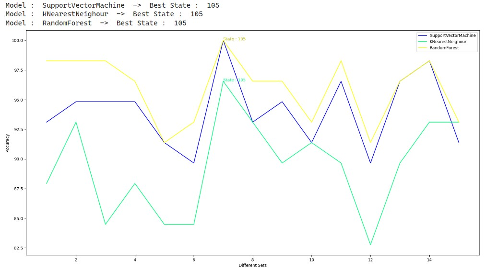
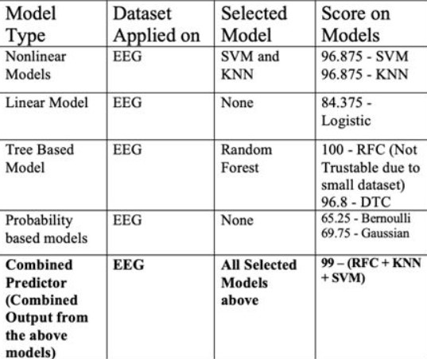
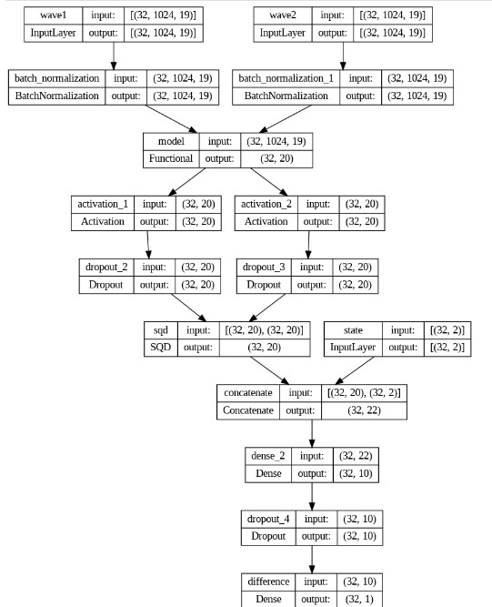

# Exploring the potential of ML/DL for Alzheimer's detection  
**Abstract** 
Alzheimer's disease (AD) is a Neurodegenerative disorder that affects millions of individuals around the globe. Early diagnosis of Alzheimer's disease is essential for prompt intervention and enhanced patient outcomes. In this study, the efficacy of various machine learning (ML) models for AD detection is investigated. We utilized linear models such as logistic regression, tree-based models such as random forest classifier (RFC) and decision tree classifier (DTC), probabilistic models, non-linear models such as support vector machines (SVM), and an ensemble model that combines the best of all the above models. In addition to traditional machine learning methods, we deployed a neural network model based on Few Shot Learning. Few-shot learning is distinguished by its capacity to learn new concepts or tasks with limited training data. It simulates human-like learning, in which humans can rapidly comprehend new information or identify new objects with only a few examples. Few-shot learning paves the way for more efficient and adaptable artificial intelligence systems that can quickly adapt to new environments or changing user needs especially in medical imaging, in which it can aid in the detection of rare diseases where labeled samples are scarce.
   

**Dataset Description**  
For Alzheimer's Detection using EEG. The dataset is downloaded from https://osf.io/s74qf/ .The database was created by Florida State University researchers using a Biologic Systems Brain Atlas III Plus workstation to record from the 19 scalp (Fp1, Fp2, Fz, F3, F4, F7, F8, Cz, C3, C4, T3, T4, Pz, P3, P4, T5, T6, O1, and O2) loci of the worldwide 10-20 system. Cerebral lobes F–T (F: frontal, C: central, P: parietal, O: occipital, and T: temporal). Four groups—A, B, C, and D—recorded in two rest states: eyes open (A and C) by visually fixating and eyes closed (B and D) utilizing a linked-mandible reference forehead ground. 24 healthy seniors comprise Groups A and B. Groups C and D have 24 likely AD patients . 8-s EEG segments band-limited to 1-30 Hz were recorded at 128 Hz and extracted without eye motion, blinking. EEG technicians tracked each patient's attention.The dataset sample size of 48 is converted to 192 in total using Data Augmentation techniques such as  
  
  - **Time Shifting & Noising**: Time shifting involves shifting the entire time series forward or backward by a certain number of time steps. This technique helps introduce variations in the temporal structure of the data. By shifting the time series, you can simulate different time lags, delays, or phase shifts, which can be valuable for modeling time-dependent patterns or capturing temporal dependencies.Noising is the process of adding random noise to the time series data. This technique introduces randomness and perturbations into the data, which can help improve the robustness of models and reduce overfitting. Various types of noise can be added, such as Gaussian noise, random walk noise, or seasonal noise, depending on the characteristics of the data and the desired augmentation effect.

- **Rolling Mean**: It calculates the average of a specific window of time steps across the time series. The window size determines the number of adjacent data points considered for each average calculation. By taking the rolling mean, the time series is smoothed, and high-frequency noise or fluctuations are attenuated.

   

**Model** 
The models used for the EEG dataset (Augmented) are tree-based models, probability-based models, and non-linear models. Combined predictions from the best models are used to generate the final output using majority voting.

On the 48 samples of the EEG dataset (Non-Augmented), Few Shot Learning neural network models have been deployed. A substantial quantity of labeled data is required for deep learning models to generalize effectively and perform accurately. In medical imaging, it may be impractical or impossible to acquire such vast quantities of labeled data for each class. The concept of "few-shot learning" is now relevant. Few-shot learning is a subset of machine learning that enables models to learn from a small number of labeled examples, thereby overcoming the issue of insufficient data. The few-shot classification method employs a Siamese Network to learn embeddings based on sample similarities. The network requires a Two Input of arbitrary class. The network creates embeddings for both similar (same class pair) and dissimilar (different class pair) pairs during training. Embeddings of the pair are taught to be near for pairs of the same class and far for pairs of different classes. During the prediction process, the network compares the embeddings of the new sample to those of the reference samples of different classes by calculating similarity or dissimilarity scores (comparison score) between them using Euclidean distance or cosine similarity, and labels the new sample accordingly. For example, sample 'x' will be assigned to class 'A' if its embeddings resemble those of class 'A' samples more than those of reference samples from other classes. So, Instead of classifying whether a patient's sample is indicative of Alzheimer's disease or not, we may simply compare it to the Alzheimer's reference sample and the Non-Alzheimer's reference sample (healthy sample) and assign it to the closest class. Consequently, the network can classify new samples even when labeled data are scarce.
   

**Results**    

**Machine Learning (Augmented Dataset)** : 
   

Performance scores of chosen models on different subsets of training data  

  

Performance scores of all the models  

  
 
**Few Shot Learning (Non - Augmented Dataset)** :  

Architecture of Few Shot Siamese Network  

  

Siamese Network Dissimilarity Scores  

  

  

